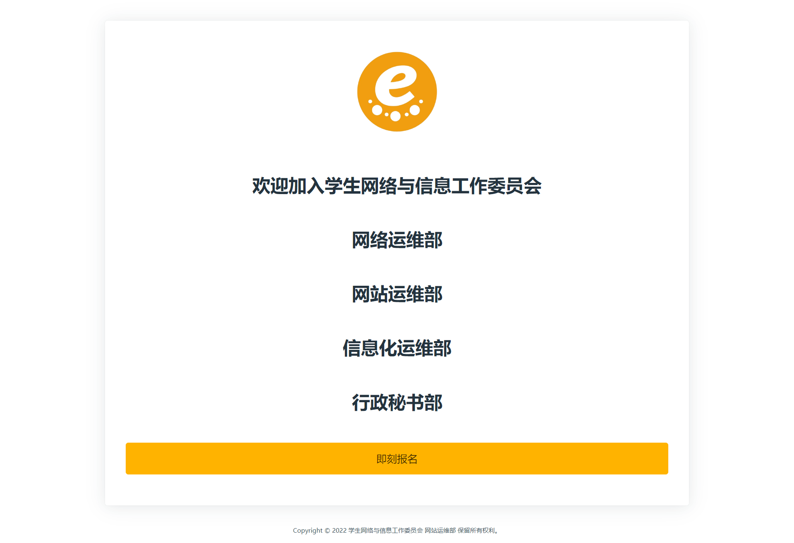
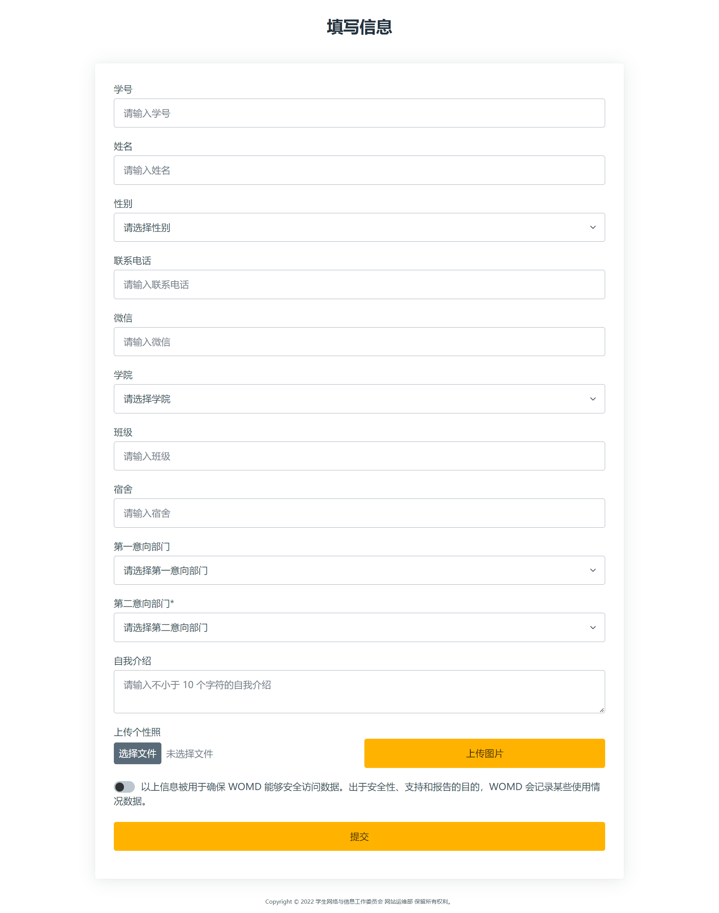
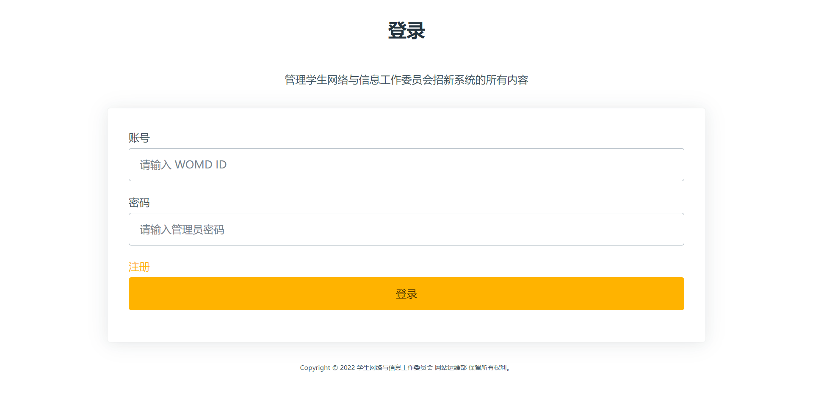
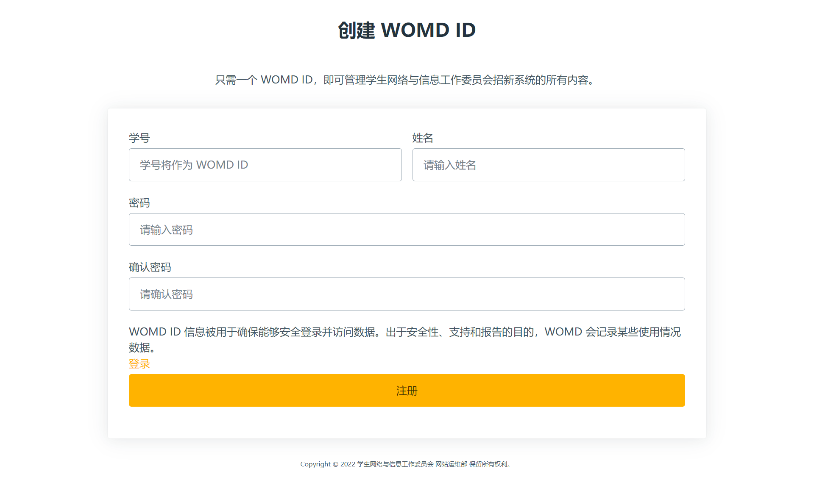
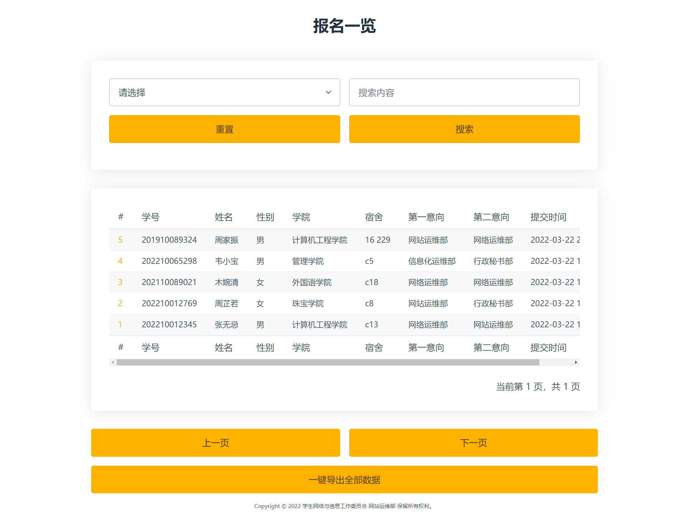
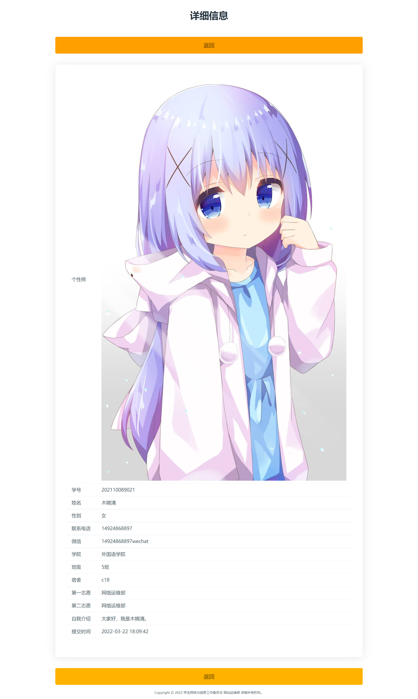

# super-registration-form

English | [简体中文](README_zh.md)

## Table of Contents

-   [super-registration-form](#super-registration-form)
    -   [Table of Contents](#table-of-contents)
    -   [Background](#background)
    -   [Install](#install)
    -   [Usage](#usage)
        -   [Welcome](#welcome)
        -   [Form](#form)
        -   [Admin Signin](#admin-signin)
        -   [Admin Signup](#admin-signup)
        -   [List](#list)
        -   [Detail](#detail)
    -   [Sponsor](#sponsor)
    -   [Maintainer](#maintainer)
    -   [Contributors](#contributors)
    -   [License](#license)

## Background

super-registration-form is a front-end recruitment system solution built by WOMD. It is based on Vue.js 3 and TypeScript, and the overall UI uses the orange color scheme of the Student and Network Information Committee logo. It uses the latest front-end technology stack and covers almost all scenarios of registration in the recruitment process, including registration information validation/submission, administrator login/registration, form list/details, one-click data export, etc.

## Install

```shell
# clone the project
git clone https://github.com/gcuwomd/super-registration-form.git

# enter the project directory
cd super-registration-form

# install dependency
yarn

# develop
yarn dev

# build
yarn build
```

## Usage

The following data are randomly generated.

### Welcome



### Form



### Admin Signin



### Admin Signup



### List



### Detail



## Sponsor

[广州城市理工学院网络与信息中心](https://nc.gcu.edu.cn/)

## Maintainer

[](https://github.com/GeniusCorn)
[@GeniusCorn](https://github.com/GeniusCorn)

## Contributors

Feel free to dive in! [Open an issue](https://github.com/gcuwomd/super-registration-form/issues/new) or submit PRs.

Standard Readme follows the [Contributor Covenant](https://www.contributor-covenant.org/version/1/3/0/code-of-conduct/) Code of Conduct.

This project exists thanks to all the people who contribute.

[](https://github.com/Peng-Hello)
[@Peng-Hello](https://github.com/Peng-Hello)

[](https://github.com/JammieGriffin)
[@JammieGriffin](https://github.com/JammieGriffin)

## License

[MIT](LICENSE)
