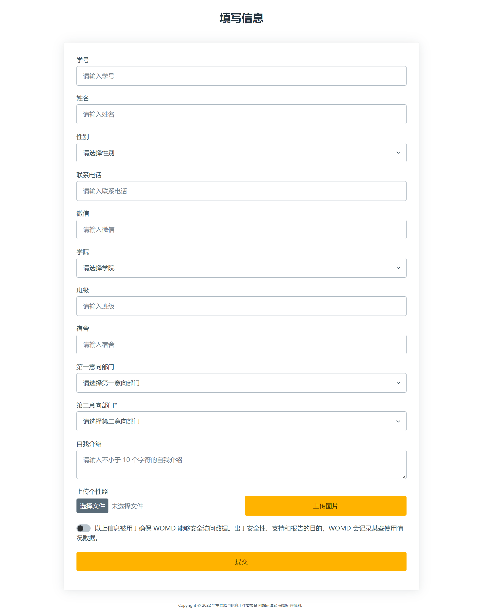
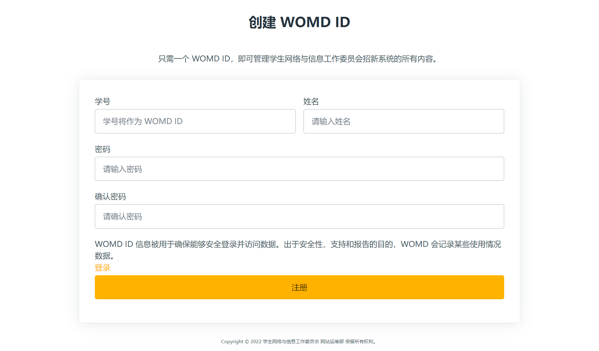
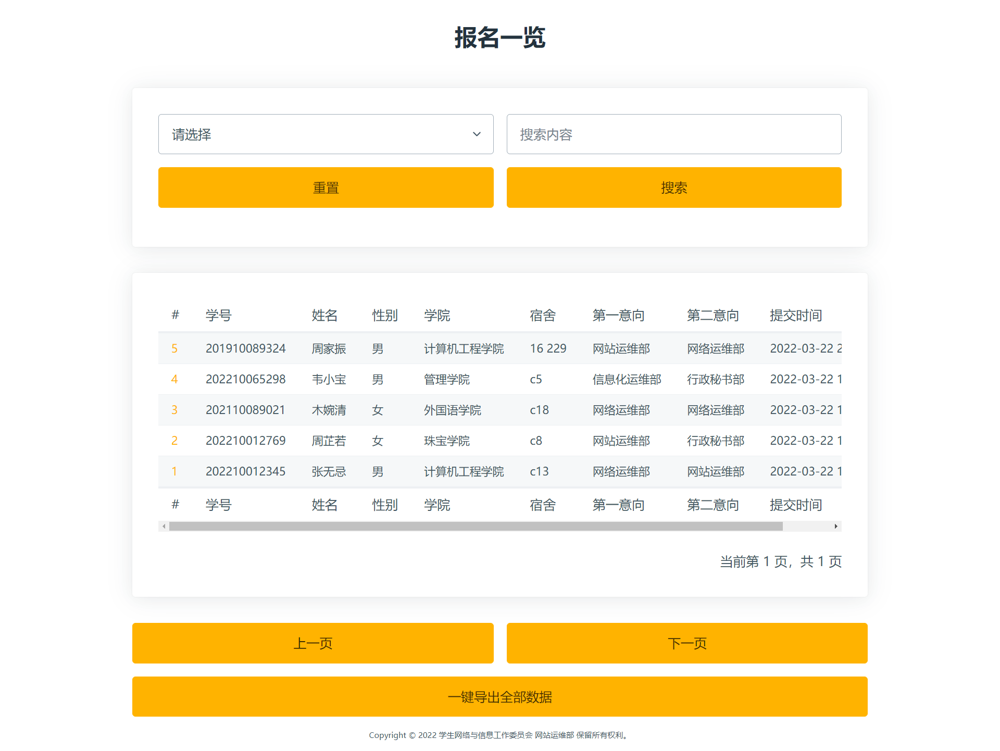
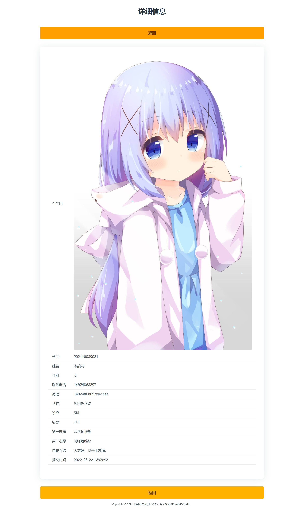

# super-registration-form

[English](README.md) | 简体中文

## 目录

-   [super-registration-form](#super-registration-form)
    -   [目录](#目录)
    -   [背景](#背景)
    -   [安装](#安装)
    -   [使用](#使用)
        -   [欢迎](#欢迎)
        -   [报名](#报名)
        -   [管理员登录](#管理员登录)
        -   [管理员注册](#管理员注册)
        -   [表单一览](#表单一览)
        -   [报名详情](#报名详情)
    -   [感谢](#感谢)
    -   [维护者](#维护者)
    -   [贡献](#贡献)
    -   [使用许可](#使用许可)

## 背景

super-registration-form 是由网站运维部打造的一个前端招新系统解决方案。它基于 Vue.js 3 和 TypeScript 实现，整体 UI 使用了学生与网络信息委员会标志的橙色配色。它使用了最新的前端技术栈，覆盖了在招新过程中进行报名的几乎所有场景，包括报名信息验证/提交、管理员登录/注册、表单一览/详情、一键导出数据等功能。

## 安装

```shell
# 克隆项目
git clone https://github.com/gcuwomd/super-registration-form.git

# 进入项目目录
cd super-registration-form

# 安装依赖
yarn

# 开发
yarn dev

# 构建
yarn build
```

## 使用

以下数据均为随机生成。

### 欢迎


### 报名



### 管理员登录


### 管理员注册



### 表单一览



### 报名详情



## 感谢

[广州城市理工学院网络与信息中心](https://nc.gcu.edu.cn/)

## 维护者

[](https://github.com/GeniusCorn)
[@GeniusCorn](https://github.com/GeniusCorn)

## 贡献

非常欢迎你的加入！[提一个 Issue](https://github.com/gcuwomd/super-registration-form/issues/new) 或者提交一个 Pull Request。

标准 Readme 遵循 [Contributor Covenant](https://www.contributor-covenant.org/version/1/3/0/code-of-conduct/) 行为规范。

感谢以下参与项目的人：

[](https://github.com/Peng-Hello)
[@Peng-Hello](https://github.com/Peng-Hello)

[](https://github.com/JammieGriffin)
[@JammieGriffin](https://github.com/JammieGriffin)

## 使用许可

[MIT](LICENSE)
